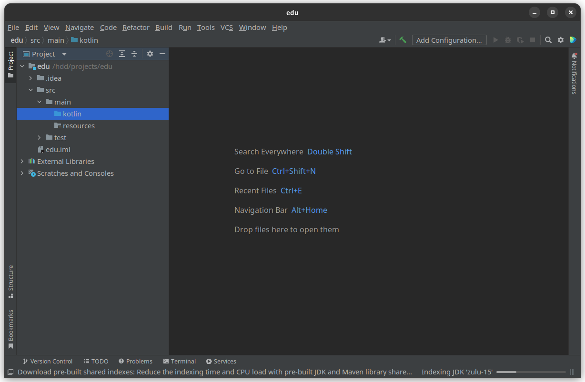

# Среда разработки
Для начала, давайте перейдём к разбору среды разработки. Создадим проект, с которым будем работать в дальнейшем.
## Как установить
Intellij Idea делиться на два вида: **Community Edition** (бесплатная версия) и **Ultimate Edition** (платная версия).
Выбирайте то, что вам подходит. Ну и, стоит уточнить, что, если вы студент или школьник, вы можете получить бесплатно Ultimate Edition для учебных целей заполнив форму с вашими данными (студенческий).
Я буду использовать первый вариант так как принципиально они ничем не отличаются.
Скачать можно из специальной утилиты ([Jetbrains Toolbox](https://www.jetbrains.com/ru-ru/toolbox-app/)) или же скачать конкретно IDE [тут](https://www.jetbrains.com/ru-ru/idea/download/#section=linux).
Устанавливая ставьте удобные вам параметры темы и прочего.
## Создание проекта
Давайте же создадим проект:

Нажимаем «New Project» для создания нашего проекта:

Называть проект можно как угодно, однако желательно называть латиницей.
Язык, естественно, Kotlin, а Build система Intellij (не будем менять, рассмотрим системы сборки потом).
Нажимаем «Create» и создаём наш проект.
В новом окне появится наш проект со структурой по умолчанию.

Пока можете создать файл «Main.kt» чтобы позже писать туда код и его проверять.
Чтобы его создать нажмите правой кнопкой мыши на папку «kotlin» -> «New» -> «Kotlin File» и впишите «Main».